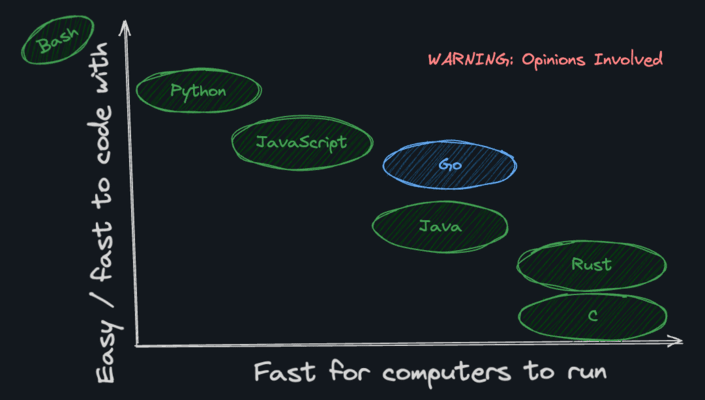

# COMPARIING GO'S SPEED

Go is _generally_ faster and more lightweight interpreted or VM-powered languages like:

- Python
- JavaScript
- PHP
- Ruby
- Java

However, in terms of execution speed, Go does lag behind some other compiled languages like:

- C
- C++
- Rust

Go is a bit slower mostly due to its automated memory management, also known as the "Go runtime". Slightly slower speed is the price we pay for memory safety and simple syntax!

