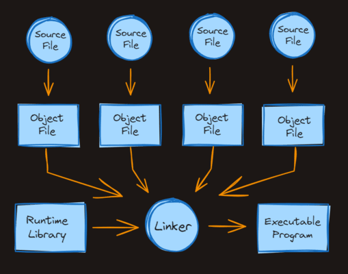

# COMPILING EXPLAINED

Computers don't know how to do anything unless we as programmers tell them what to do.

Unfortunately, computers don't understand human language. They don't even understand uncompiled computer programs.

For example, the code:

    packacge main

    import "fmt"

    func main() {
        fmt.Println("Hello, World!")
    }

means _nothing_ to a computer.

### COMPUTERS NEED MACHINE CODE

A computer's CPU only understands its own _instruction set_, which we call "machine code".

Instructions are basic math operations like addition, subtraction, mulitplication, and the ability to save data temporarily.

For example, an ARM processor uses the _ADD_ instruction when supplied with the number `0100` in binary.

### GO, C, RUST, ETC.

GO, C, and Rust are all languages where the code is first converted to machine code by the compiler before it's executed.

