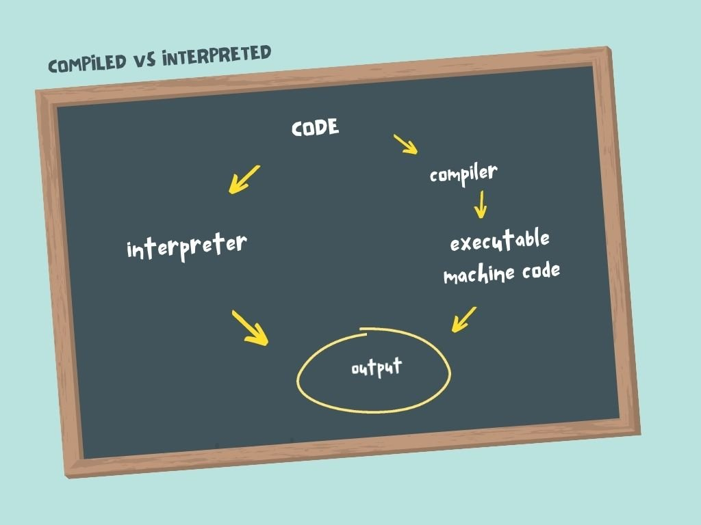

# COMPILED VS INTERPRETED

You can run a compiled program _without_ the original source code. You don't even need a compiler.

This is different than interpreted languages like Python and JavaScript. With Python and JavaScript, the code is interpreted at runtime by a separate program known as the "interpreter". Distributing code for users to run can be a pain because they need to have an interpreter installed, and they need access to the source code.

#### EXAMPLES OF COMPILED LANGUAGES

- Go
- C
- C++
- Rust

#### EXAMPLES OF INTERPRETED LANGUAGES

- JavaScript
- Python
- Ruby

