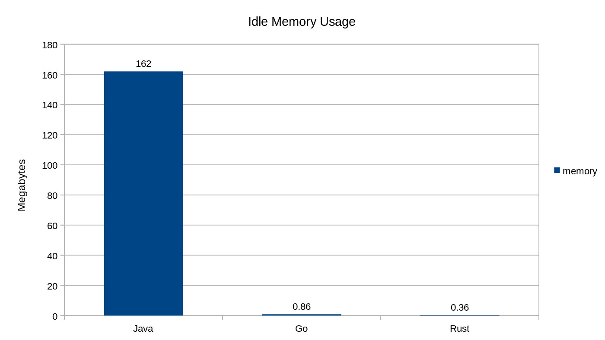

# GO PROGRAMS ARE EASY ON MEMORY

Go programs are fairly lightweight. Each program includes a small amount of "extra" code that's included in the executable binary. This extra code is called the Go Runtime. One of the purposes of the Go runtime is to clean up unused memory at runtime.

In other words, the Go compiler includes a small amount of extra logic in every Go program to make it easier for developers to write code that's memory efficient.

### COMPARISON

As a general rule, Java programs use _more_ memory than comparable Go programs. There are several reasons for this, but one of them is that Java uses an entire virtual machine to interpret bytecode at runtime. Go programs are compiled into machine code, and the overhead of the Go runtime is typically less than the overhead of the Java virtual machine.

On the other hand, Rust and C programs use slightly _less_ memory than Go programs because more control is given to the developer to optimize the memory usage of the program. The Go runtime just handles if for us automatically.

### IDLE MEMORY USAGE

In the chart above, Dexter Darwich compares tehe memory usage of three _very_ simple porgrams written in Java, Go, and Rust. As you can see, Go and Rust use _very_ little memory when compared to Java.
