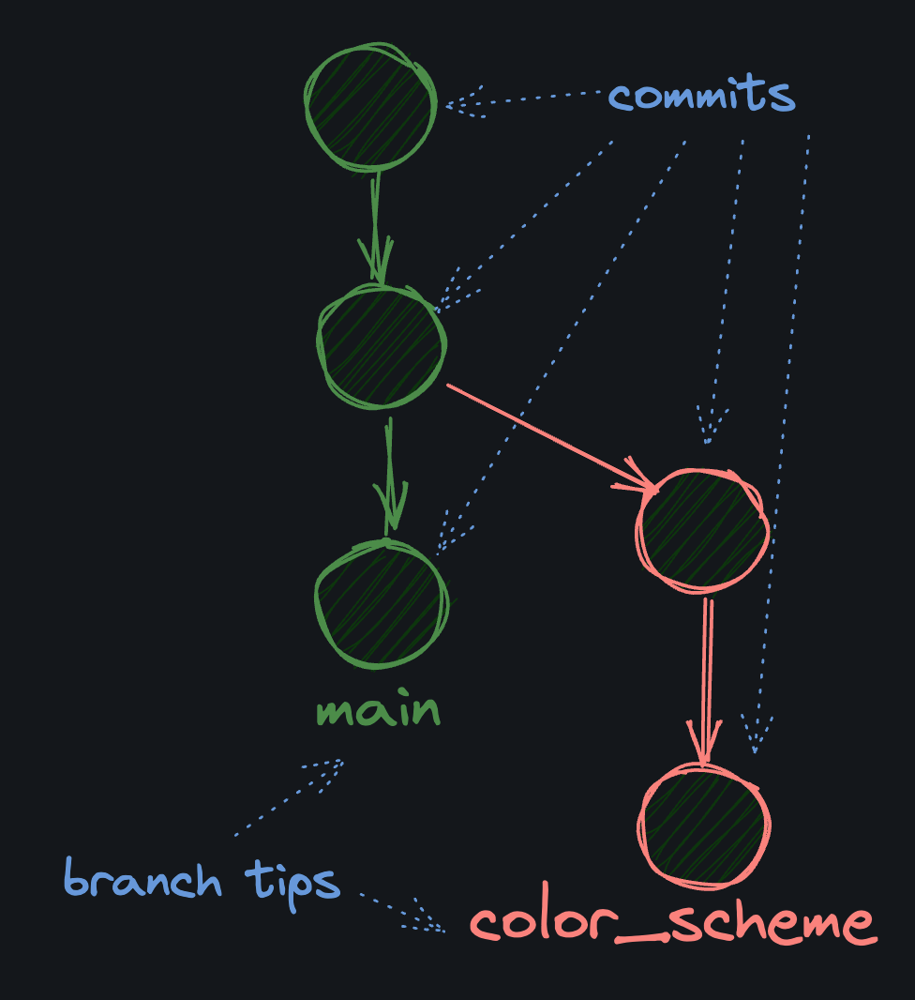

# WHAT IS A BRANCH?

A Git branch allows you to keep track of different changes separately.

For example, let's say you have a big web project and you want t oexperiment with changing the color scheme. Instead of changing the entire project directly (as of right now, our `master` branch), you can create a new branch called `color-scheme` and work on that branch. When you're done, if you like the changes, you can merge the `color-scheme` branch back into the `master` branch to keep the changes. If you don't like the changes, you can simply delete the `color-scheme` branch and go back to the `master` branch.

### UNDER THE HOOD

A branch is just a named pointer toa specific commit. When you create a branch, you are creating a new pointer to a specific commit. The commit that the branch pints to is called the tip of the branch.

Because a branch is just a pointer to a commt, they're lightweight and "cheap" resourcewise to create. When you create 10 branches, you're not creating 10 copies of your project on your hard drive.

### TIP

Remember, you should be on `master` because we set `init.defaultBranch` to `master` at the start of the course.
